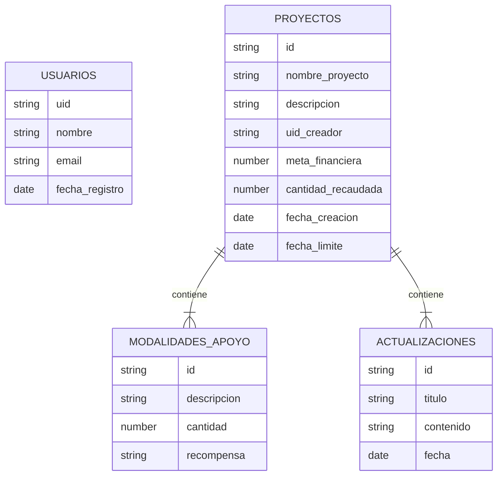

# Ejemplo: Aplicación web de *crowdfunding*

Se pretende desarrollar una aplicación para dar soporte a proyectos financiados con *crowdfunding*. Los usuarios en general podrán ver los proyectos del sitio, apoyarlos con un determinado nivel de recompensa, y ver noticias sobre los mismos. Los creadores de un proyectos podrán editarlo, enviar noticias sobre su progreso, etc...

## Parte 1: Requerimientos

Los casos de uso básicos son:

* Un usuario sin estar autentificado debe poder ver los datos básicos de la lista de proyectos más populares en el sitio
* Un usuario sin estar autentificado debe poder ver todos los datos de un proyecto,que incluyen también las últimas actualizaciones sobre el mismo.
* Un usuario debe poder hacer login y logout en la aplicación
* Un usuario debe poder darse de alta, editar su perfil y darse de baja
* Un usuario autentificado debe poder elegir una modalidad de apoyo y apoyar un proyecto con esa cantidad
* El usuario que ha creado un proyecto, si está autentificado debe poder gestionar actualizaciones (noticias) sobre el estado del mismo (operaciones: crear, ver, modificar, borrar)
* El usuario que ha creado un proyecto, si está autentificado debe poder gestionar (crear, ver, modificar y borrar) modalidades de apoyo (descripción, cantidad que se pide, recompensa obtenida a cambio...)

## Parte 2: Modelo de datos

Usaremos un diagrama ER para representar el modelo de datos de Firestore ya que no hay una convención universal para representar diagramas de bases de datos NoSQL, pero hay que recalcar que no hay tablas ni relaciones entre ellas con claves ajenas. En el diagrama, las entidades son colecciones de Firestore y las relaciones entre entidades no son tales sino que representan subcolecciones.

> NOTA: los usuarios en la colección `Usuarios` son los mismos que en auth pero pueden tener datos adicionales, cada vez que un usuario se dé de alta con `createUserWithEmailAndPassword` añadiríamos un usuario a la colección de `Usuarios` con otros datos adicionales como la fecha de registro o el nombre (este último en el futuro vendrá del formulario que el usuario rellene en la web, de momento para probar pasaremos esos datos manualmente).

## Parte 3: Prototipado simple del sitio web

## Parte 4: Desarrollo del *backend*

En este ejemplo no se ha desarrollado este apartado porque una parte importante del código se parecería demasiado al vuestro :), así que tendréis que escribirlo vosotr@s mism@s...