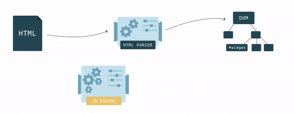

<!-- .slide: class="titulo" -->

# Tema 4: Javascript en clientes web: 
## Parte I: introducción, eventos y API del DOM


---

<!-- .slide: class="titulo" -->

## 4.1 
## Javascript en el cliente: conceptos básicos

---

En el principio Javascript y el desarrollo *frontend* era **esto**


```html
<h1>Mi web</h1>
<script>
  alert("¡¡Bienvenido a mi web!!")
</script>
```

La web de los 90s: [https://sophieswebsite1999.neocities.org/](https://sophieswebsite1999.neocities.org/)

---

Pero el desarrollo *frontend* actual no es trivial


[https://x.com/wycats/status/930463710941872128?s=20](https://x.com/wycats/status/930463710941872128?s=20)

---

## Versiones de JS en el navegador

Javascript (también llamado ECMAScript o ES) es un lenguaje en rápida evolución

- La última gran "revolución" en JS fue ES2015, a.k.a. ES6
- Cada año hay un nuevo estándar: ES2021, ES2022,...
- Importa el [soporte de funcionalidades](https://caniuse.com/?search=ecmascript) más que de versiones


---

## Transpilación

- Si el navegador objetivo no soporta las funcionalidades que necesitamos se pueden usar compiladores ([*transpiladores*](https://en.wikipedia.org/wiki/Source-to-source_compiler)) que **traduzcan de las versiones nuevas de Javascript a código más antiguo** 
- El transpilador más usado actualmente es [**Babel**](https://babeljs.io/)
- Se empezaron a usar para transformar ES6->ES5, en general ya no necesario. Se sigue usando para dar soporte a navegadores *legacy* y para poder emplear funcionalidades recientes 
- También se usa para traducir otros formatos a JS [como .jsx](https://babeljs.io/docs/en/babel-plugin-transform-react-jsx), propio de React

---


Como curiosidad: Babel lo empezó a escribir Sebastian McKenzie a los 17 años mientras estaba en el instituto. Podéis leer [la historia de esta época](https://medium.com/@sebmck/2015-in-review-51ac7035e272#.1vfchy3bc) contada por él mismo.

---

## Insertar JS en el HTML

- En etiquetas `<script>`
- El ámbito de las variables y funciones definidas es la *página*
- Por defecto el JS se *parsea* y ejecuta conforme se va leyendo

```html
<html>
<head>
  <script>   
    //esto define la función pero no la llama todavía
    function ahora() {            
       var h = new Date();    
       return h.toLocaleString(); }
    var verFecha = true;
   </script>
   <!-- podemos cargar JS externo con un tag vacío y su URL en el src -->
   <script src="otroscript.js"></script>
</head>
<body>
   <script>
      //la variable es visible por estar definida antes en la misma página
      if (verFecha)
        alert("Fecha y hora: " + ahora());
   </script>
</body>
</html>
```

---

## Carga de *scripts* externos

Forma "clásica": con el atributo `src` en un `<script>` vacío conseguimos una especie de "include". Todo lo que incluímos está en el mismo "espacio de nombres"

```html
<!-- Ejemplo completo en https://jsbin.com/wiyocat/edit?html,js,output -->
<script src="https://threejs.org/build/three.js"></script>
<script>
    // Crear una escena
    var scene = new THREE.Scene();
    // Crear una cámara
    var camera = new THREE.PerspectiveCamera(75, window.innerWidth/window.innerHeight, 0.1, 1000);
    //... el ejemplo continúa...
</script>
```
- Típicamente cada `<script src="">` define una o más clases, funciones o vars. que son **globales**
- Con muchas dependencias externas, esta forma se vuelve tediosa (por la cantidad de `script src`) y problemática (por colisiones en los nombres o tener que gestionar el orden de las dependencias, si hay relaciones entre ellas)


---

Por defecto al encontrar un *script* se interrumpe la carga del HTML hasta que se acabe de cargar,_parsear_ y ejecutar el *script*. Por ello típicamente __se recomendaba colocar los scripts al final__, así el usuario no ve una página en blanco. 

Con *scripts* externos podemos usar los atributos `defer` o `async` 

[https://www.growingwiththeweb.com/2014/02/async-vs-defer-attributes.html](https://www.growingwiththeweb.com/2014/02/async-vs-defer-attributes.html)
<!-- .element class="caption"-->


---

## Módulos en JS

Claramente, los `<script src="">` no son una buena solución al **problema de la modularidad**, ya que lo único que estamos haciendo es juntar todo el código en un "espacio global".

En JS han ido surgiendo distintos sistemas de módulos, algunos estándares oficiales y otros "de facto", en la actualidad quedan

- **CommonJS** (originario de Node)
- **Módulos ES6 o ESM** (diseñados para los navegadores, también en Node desde 2020)  

---

## Módulos CommonJS

```javascript
//Archivo "modulo_saludo.js"
function saludar(nombre) {
    return "Hola qué tal, " +  nombre
}
  
module.exports =  saludar
```

```javascript
//Archivo que hace uso de "modulo_saludo"
let s = require('./modulo_saludo')
console.log(s("Pepe"))
```

---

## Módulos ESM


```javascript
//archivo modulo_saludo.js
function saludar(nombre) {
  return "Hola qué tal, " +  nombre
}
export {saludar}
```

```javascript
//archivo main.js (hace uso del modulo_saludo)
import {saludar} from './modulo_saludo.js'
console.log(saludar('Pepe'))
```

Hay muchas formas de [import](https://developer.mozilla.org/es/docs/Web/JavaScript/Reference/Statements/import)<br>


```html
<!-- en el HTML -->
<script type="module" src="main.js"></script>
```


---

## Un problema de los módulos ESM

- Aunque a fecha de hoy todos los navegadores [los implementan](https://caniuse.com/#search=modules), esto es relativamente reciente (desde 2018). **La necesidad de usar módulos en *frontend* surgió antes de que ESM se implementara en los navegadores más usados**
- A alguien se le ocurrió que se podía añadir soporte de CommonJS al navegador con una herramienta externa que "transformara" el módulo en algo que se pueda incluir con un `script src=""` (esta herramienta se llamó *bundler*)
- Como resultado, desde hace unos años **muchas dependencias de terceros se distribuyen** con `npm`, **en** formato **CommonJS** (no soportado nativamente por los navegadores)


---

## Bundlers

- Herramientas que a partir de un conjunto de módulos resuelven las dependencias y **concatenan todo el código en un único .js (*bundle*)** que el navegador puede cargar con un simple `<script src="">`
- Típicamente ofrecen compatibilidad con módulos ESM y CommonJS
- Además el *bundler* puede realizar operaciones adicionales como:
  * Llamar a un transpilador para traducir el código de ES6 a ES5
  * *minificar* el código
  * copiar los *assets* (jpg, png, ...)
  * ...
- Ejemplos: webpack, vite, parcel, rollup, esbuild ...
- Veremos su uso en prácticas


---


---

## ¿Siguen siendo necesarios los *bundlers* en el 2023?

- Teóricamente no deberían, ya que todos los navegadores soportan ESM
- Pero...
    + En producción es más eficiente descargar un solo *bundle* que muchos módulos separados (demasiadas peticiones HTTP)
    + Además del *bundle* realizan otras muchas tareas
- Hay *bundlers* modernos, como [Vite](https://vitejs.dev/), que generan *bundles* compatibles con ESM


---

## Acceso a los APIs nativos del navegador

- El navegador incluye "de serie" multitud de APIs, para: gestión de eventos, manipulación del HTML, comunicación con el servidor, guardar datos en local, dibujar gráficos,...
- Hay una serie de "objetos globales predefinidos" de los que "cuelgan" estos APIs, por ejemplo
  + `window`: el objeto global por defecto, todo lo que definimos está dentro de él.
  + `document`: la página actual
  + `navigator`: el navegador


---


Vamos a ver a continuación con más detalle los **APIs estándar** que nos permiten programar **con JS en el navegador**. Para que sea un poco más llevadero, lo haremos en forma de *demo*

---

<!-- .slide: data-background-image="images_intro/owen-wow.jpg" -->

---


<iframe src="https://www.youtube.com/embed/dn5Tattkj_E" title="YouTube video player" frameborder="0" allow="accelerometer; autoplay; clipboard-write; encrypted-media; gyroscope; picture-in-picture" allowfullscreen class="r-stretch"></iframe>


- API: https://owen-wilson-wow-api.onrender.com/

- Plantilla de ejemplo: [https://codesandbox.io/s/demo-wow-api-hlv2lg?file=/index.html](https://codesandbox.io/s/demo-wow-api-hlv2lg?file=/index.html)

---

<!-- .slide: class="titulo" -->

## 4.2 
## Eventos


---

## Eventos y *listeners*

- Casi todo el código Javascript incluido en un HTML se va a ejecutar de modo ***asíncrono***, en respuesta a **eventos**
- Los eventos pueden responder directamente a *acciones* del usuario (p.ej. `click` con el ratón) o bien a *sucesos* "externos" (p. ej. la página ha acabado de cargarse). 
- A **cada evento le podemos asociar una o más funciones JS** que se ejecutarán cuando se dispare. Genéricamente esto se conoce como *callbacks*. En el contexto de eventos, son llamados *listeners* 

---

## Definir un listener

con `addEventListener` se añade un *listener* que responde a un *evento* sobre un *elemento* del HTML

- Cada evento tiene un [nombre estándar](https://developer.mozilla.org/en-US/docs/Web/Events/keydown): 'click', 'mouseover', 'load', 'change'
- Algunos eventos son aplicables prácticamente a cualquier elemento HTML ('click', 'mouseover'). Otros solo a algunos ('change' o 'keydown' solo a campos de entrada de datos)
- Un mismo elemento y evento pueden tener asociados **varios *listener***


---

## Ejemplo de *listener*

HTML:

```html
<button id="miBoton">¡No me pulses!</button>
```

JS:

```javascript
//El listener recibirá automáticamente un objeto Event con info sobre el evento
//https://developer.mozilla.org/en-US/docs/Web/API/Event
function miListener(evento) {
    alert('Te dije que no lo hicieras!, pero has clicado en '
          + evento.clientX + ',' + evento.clientY)
}
var boton = document.getElementById('miBoton')
//cuando se haga click sobre el objeto "boton", se llamará a "miListener"
boton.addEventListener('click', miListener)
//Otra forma: definimos el listener como una función anónima
boton.addEventListener('click', function() {
   console.log('no espíes la terminal ehhh')
})
```

[https://jsbin.com/funizen/edit?html,js,output](https://jsbin.com/funizen/edit?html,js,output)


---

## Delegación de eventos

Los eventos sobre una etiqueta HTML *suben*  hacia arriba en la jerarquía de etiquetas (*bubbling up*), de modo que podemos capturarlos también en niveles superiores.

```html
<body>
  <button id="boton">Pulsa aquí</button>
  <p>Hola, aquí también puedes pulsar</p>
</body> 
```
```javascript
document.getElementById('boton').addEventListener('click', function(e) {
  console.log('en el listener del botón')
  //si ponemos esto, paramos el bubbling
  //e.stopPropagation()
})
//Aquí recibiríamos también los clicks sobre el "button" y el "p"
document.addEventListener('click', function(e){
  //En un listener, this es el objeto al que está vinculado el evento.Aquí document
  console.log("this es " + this.nodeName) //document
  //target es el "objetivo" del evento. P.ej. si clicamos en el boton será este
  console.log('click sobre ' + e.target.nodeName)
})
```
[https://jsbin.com/buvoyif/edit?html,js,console,output](https://jsbin.com/buvoyif/edit?html,js,console,output)<!-- .element class="caption" -->

---

La delegación de eventos es útil cuando queremos asignar un comportamiento similar a varios elementos sin tener que repetir el *event listener* para cada uno 

[Ejemplo "teclado simulado"](https://jsbin.com/yutame/edit?html,js,output)


---


## Eventos que no dependen del usuario

- Evento `DOMContentLoaded` (sobre `document`): indica que se ha parseado y cargado completamente el HTML
- Evento `load` (sobre `window`, `document` o `script`): indica que se ha cargado completamente un recurso y sus dependientes (por ejemplo si es sobre `window` no solo el HTML sino también los *scripts*, imágenes)


```javascript
document.addEventListener('DOMContentLoaded', function() {
  alert("Ahora ya puedo marearte con este bonito anuncio")
})
```

---

## Event handlers

Forma *legacy* de definir *listeners*.  Además de la sintaxis, la diferencia principal es que __solo puede haber un handler__ para un evento y un elemento HTML dados

Los *handler* tienen como nombre 'onXXX', donde 'XXX' es el nombre del evento: 'onclick', 'onmouseover', 'onload',...

---

## Ejemplo de *handler*

HTML:

```html
<button id="miBoton">¡No me pulses!</button>
```

JS:

```javascript
var boton = document.getElementById('miBoton')
boton.onclick = function() {
    console.log('has hecho click')
} 
//CUIDADO, este handler SUSTITUIRÁ al anterior!!!
boton.onclick = function() {
    alert('has hecho click')
} 
```


---

## Manejadores de evento *inline*

La forma más antigua de definir *handlers*: en el propio HTML, con un atributo `onXXX`:

```html
<!-- nótese que decimos que hay que INVOCAR la función, y no la
  referenciamos simplemente como hasta ahora. Esto es porque aquí 
  podemos poner código arbitrario. Pero un listener debía ser una función -->
<button onclick="mensaje()">¡No me pulses!</button>
```

```javascript
function mensaje() {
   console.log('mira que eres pesadito/a')
}
```

Tiene "mala prensa" porque mezcla JS y HTML. Curiosamente en los *frameworks* web modernos se tiende a usar esta forma de programar 🤯.


---

<!-- .slide: class="titulo" -->

## 4.3
## Manipulación del HTML: el API DOM

---

**DOM** (*Document Object Model*): por cada etiqueta o componente del HTML actual hay en memoria un objeto Javascript equivalente. 

Los objetos JS forman un árbol en memoria, de modo que un nodo del árbol es "hijo" de otro si el elemento HTML correspondiente está *dentro* del otro.

**API DOM**: conjunto de APIs que nos permite acceder al DOM y manipularlo. Al manipular los objetos JS estamos cambiando indirectamente el HTML *en vivo* 



---

## El árbol del DOM

[Live DOM Viewer](https://software.hixie.ch/utilities/js/live-dom-viewer/?%20%3C!DOCTYPE%20html%3E%0A%3Chtml%3E%0A%3Chead%3E%0A%3Ctitle%3EEjemplo%20de%20DOM%3C%2Ftitle%3E%0A%3C%2Fhead%3E%0A%3Cbody%3E%0A%3C!--%20es%20un%20ejemplo%20un%20poco%20simple%20--%3E%0A%3Cp%20style%3D“color%3Ared”%3EBienvenidos%20al%20%3Cb%3EDOM%3C%2Fb%3E%3C%2Fp%3E%0A%3C%2Fbody%3E%0A%3C%2Fhtml%3E)


---

## Acceder a un nodo

**Por `id`**. "marcamos" con un `id` determinado aquellas partes de la página que luego queremos manipular dinámicamente

```javascript
var noticias = document.getElementById("noticias")
```

**Por etiqueta**: accedemos a todas las etiquetas de determinado tipo

```javascript
//Ejemplo: reducir el tamaño de todas las imágenes a la mitad
//getElementsByTagName devuelve un array
var imags = document.getElementsByTagName("img"); 
for(var i=0; i<imags.length; i++){
      //por cada atributo HTML hay una propiedad JS equivalente
      imags[i].width /= 2;
      imags[i].height /= 2;
}
```

---

## Acceder a un nodo (II)

Con [**selectores CSS**](https://developer.mozilla.org/es/docs/Web/CSS/Introducción/Selectors):

```javascript
//querySelector: obtener el 1er nodo que cumple la condición
//este ejemplo sería equivalente a getElementById
var noticias = document.querySelector('#noticias')
//aunque puede haber varios divs solo obtendremos el 1o
var primero = document.querySelector("div");
//querySelectorAll: obtenerlos todos (en un array)
var nodos = document.querySelectorAll("div");
//Cambiamos la clase. Nótese que el atributo es “className”, no “class”
//al ser "class" una palabra reservada en JS
for (var i=0; i<nodos.length; i++) {
    nodos[i].className = "destacado";
}
//selectores un poco más complicados
var camposTexto = document.querySelectorAll('input[type="text"]');
var filasPares = document. querySelectorAll("tr:nth-child(2n)")
```

---

## "Datos básicos" de un nodo

En un nodo tenemos su nombre (`nodeName`) y su valor (`nodeValue`)

- Para las etiquetas, el nombre es la etiqueta en mayúsculas y sin `< >` y el valor `null`
- Para los nodos de texto, el nombre siempre es `#text` y el valor su contenido
- En los campos de formulario editables, el contenido no está en `nodeValue` sino en `value` 

---

## Relaciones "familiares" entre nodos

Una vez accedemos a un nodo podemos acceder a su "padre", "hijos" o "hermanos" con una serie de propiedades:

- Padre: `parentNode`
- Hijos 
  -  Solo los *tags*: array `children`. Primero=>`firstElementChild`, último=> `lastElementChild` 
  -  Todos (incl. *whitespace nodes*): array `childNodes`. Primero=>`firstChild`, Último=>`lastChild` 
- Hermanos:
  - Solo los *tags*: siguiente `nextElementSibling`, anterior `previousElementSibling`
  - Todos (incl. *whitespace nodes*): `nextSibling`, `previousSibling`

---

## Añadir/eliminar/crear nodos

La idea de poder añadir/eliminar/crear nodos para que cambie el HTML es muy **potente**, pero el API es **tedioso** de utilizar

```javascript
<input type="button" value="Añadir párrafo" id="boton"/>
<div id="texto"></div>
<script>
 document.getElementById("boton").addEventListener('click', function() {
   var texto = prompt("Introduce un texto para convertirlo en párrafo");
   /* Nótese que la etiqueta <p> es un nodo, y el texto que contiene es OTRO 
      nodo, de tipo textNode,  hijo del nodo <p> */
   var par = document.createElement("P");
   var nodoTexto = document.createTextNode(texto);
   par.appendChild(nodoTexto);
   document.getElementById('texto').appendChild(par);
 })
</script>
```

[http://jsbin.com/gaxehayeni/edit?html,js,output](http://jsbin.com/gaxehayeni/edit?html,js,output)

---

## Manipular directamente el HTML

Insertar/eliminar directamente una **cadena HTML** en determinado punto (internamente se siguen añadiendo/eliminando nodos como antes, pero ahora es automático) 

`innerHTML`:  propiedad de lectura/escritura que refleja el HTML dentro de una etiqueta.

```javascript
<input type="button" value="Pon texto" id="boton"/>
<div id="texto"></div>
<script>
 document.getElementById("boton").addEventListener('click', function() {
    var mensaje = prompt("Dame un texto y lo haré un párrafo")
    var miDiv = document.getElementById("texto")
    miDiv.innerHTML += "<p>" + mensaje + "</p>"  
 })
</script>
```

Nótese que el `+=` de este ejemplo es ineficiente, ya que estamos *reevaluando* el HTML ya existente

---

## Insertar directamente HTML

`insertAdjacentHTML(posicion, cadena_HTML)`: método llamado por un nodo, inserta HTML en una posición relativa a él.  `posicion` es una cte. con posibles valores  `"beforebegin"`, `"afterbegin"`, `"beforeend"`, `"afterend"` 

```html
<div id="texto">Hola </div>
<button id="boton">Añadir</button>
```

```javascript
document.getElementById("boton").addEventListener('click', function() {
   var nodoTexto = document.getElementById("texto");
  nodoTexto.insertAdjacentHTML("beforeend", "<b>mundo</b>");
  nodoTexto.insertAdjacentHTML("afterend", "<div>más texto</div>");
})
```

[http://jsbin.com/romewolidi/edit?html,output](http://jsbin.com/romewolidi/edit?html,output)

---

La mayoría de *frameworks Javascript* nos liberan de la necesidad de modificar el DOM directamente

- En algunos podemos **vincular**  elementos HTML con partes del modelo, de manera que se **actualicen automáticamente** (*binding*). Ejemplos: Knockout, Angular, Svelte...
- En otros simplemente **especificamos el HTML deseado** y el *framework* se encarga de modificar solo las partes que cambian. Por ejemplo React, Vue,...

Lo veremos con detalle en el tema siguiente, de momento un ejemplo sencillo...

---

## Ejemplo con Vue

[https://jsbin.com/nahikon/edit?html,js,output](https://jsbin.com/nahikon/edit?html,js,output) <!-- .element: class="caption" -->

```html
<div id="app">
  Tu nombre: <input type="text" v-model="nombre"><br>
  <button v-on:click="generarPuesto">Generar puesto</button>
  <div class="tarjeta">
      {{nombre}} <br> {{puesto}}
  </div>  
</div>    
```
 
```javascript
var app = new Vue({
   el:'#app',
   data: {
     nombre: "",
     puesto: ""
   },
   methods: {
     generarPuesto: function() {
       this.puesto = faker.name.jobTitle()
     }
   }
 })
```
