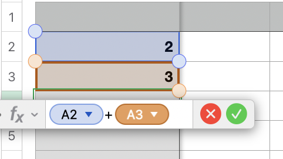
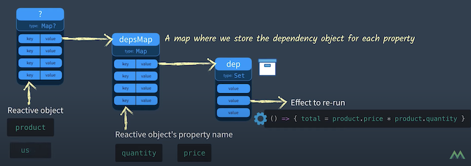
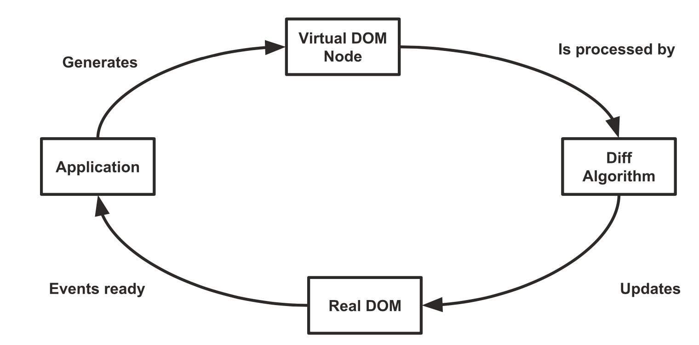

<!-- .slide: class="titulo" -->

# Tema 5: *Frameworks* JS en el cliente
## Parte II: Reactividad y _rendering_ en Frameworks JS

---

Recordemos que prácticamente todos los *frameworks JS* actuales tienen características similares:

- Basados en la idea de **componentes** *anidables*
- Automatizan el *rendering*  de HTML (gracias a la **reactividad**))
- Implementan **routing** (*)
- Ofrecen mecanismos de **gestión del estado** (los datos que no son propios de los componentes) (*)

(*) Algunos *frameworks* tienen esto integrado, en otros son *plugins*


---

<!-- .slide: class="titulo" -->

# Reactividad en *frameworks* JS


---

Aunque **reactividad** es un término bastante amplio que tiene distintos significados en distintos contextos, en el contexto de los *frameworks* JS se suele entender como:

1. **cambiar automáticamente el valor de una variable** cuando esta depende de otra
2. **repintar la vista automáticamente cuando cambia el estado** del componente 

En general todos los *frameworks* JS son reactivos al menos en el sentido (2), en el (1) solo algunos como Vue, Svelte, SolidJS, ...

---

En realidad la reactividad no es nada nuevo

 <!-- .element class="stretch" -->


---

En *frameworks* JS se pueden distinguir dos tipos de reactividad:

- **Tipo *pull***: El componente "tira" de las variables cuando las necesita. Disparar esta reactividad suele requerir la "colaboración" del desarrollador. Típicamente hay que llamar a un método para actualizar el estado, que fuerza el repintado de la vista. Por ejemplo: React, Svelte 2, Angular (aunque este último hace el *pull* automáticamente, por ejemplo en manejadores de evento)
- **Tipo *push***: al cambiar los datos se recalculan las dependencias y/o repinta la vista automáticamente. Ejemplos: Vue, Svelte 3, SolidJS

---


## Ejemplos de reactividad tipo "pull"

- [Ejemplo de código "de juguete"](https://jsbin.com/cozigix/2/edit?html,js,console,output) 
  - Para probarlo escribir en la consola `setState({contador:0}`. A partir de ahí se puede usar el botón (que llama a `setState`) 
- [Ejemplo con el framework React (bueno, preact)](https://preactjs.com/repl/?code=aW1wb3J0IHsgcmVuZGVyIH0gZnJvbSAncHJlYWN0JzsKaW1wb3J0IHsgdXNlU3RhdGUgfSBmcm9tICdwcmVhY3QvaG9va3MnOwoKZnVuY3Rpb24gQ291bnRlcigpIHsKCWNvbnN0IFt2YWxvciwgc2V0VmFsb3JdID0gdXNlU3RhdGUoMCk7CiAgCiAgZnVuY3Rpb24gaW5jcmVtZW50YXIoKSB7CgkJc2V0VmFsb3IodmFsb3IrMSkKCX0KCiAgY29uc29sZS5sb2coIlJlbmRlciBjb250YWRvciIpCglyZXR1cm4gKAoJCTw%2BCgkJCTxoMT57dmFsb3J9PC9oMT4KCQkJPGJ1dHRvbiBvbkNsaWNrPXtpbmNyZW1lbnRhcn0%2BSW5jcmVtZW50YXI8L2J1dHRvbj4KCQk8Lz4KCSk7Cn0KCnJlbmRlcig8Q291bnRlciAvPiwgZG9jdW1lbnQuZ2V0RWxlbWVudEJ5SWQoJ2FwcCcpKTsK) (podéis ver que la idea es muy similar, aunque la función que hace *pull* es `useState`)


---

## Reactividad push

Como ya sabíais, Javascript no es reactivo:

```javascript
var a1 = 2
var a2 = 3
var total = a1 + a2
console.log(total)  //5
a1 = 10
console.log(total)  //sigue siendo 5 😕
```

---
## Reactividad push en Vue

Vue incorpora funcionalidades que hacen reactivo el código (con cierta colaboración del desarrollador): 

```javascript
import { reactive, watchEffect } from 'vue';

let estado = reactive({valor:1})

watchEffect(function(){
  console.log("valor", estado.valor)
})

//ejecutará otra vez el console.log
estado.valor = 2
```

[El ejemplo online](https://play.vuejs.org/#eNp9kUFPwzAMhf9KlMs6aSpCcBoDCdAOcAAEHHOpMrfrSJ0ocbpJVf87bspGkdBuid/nl2enk/fO5W0EuZSroH3tSASg6O4U1o2znkQn9gXp7bosQZPoReltI2bcMruZMB4KTXULfwCFBkhAoGJjxe2Jybq2MNYvL/u5QoUT+6yMyIjFbN4pFEJbDNZAbmyVKZm6lFz8OObpzhajzepizM/JFcqFpMDdZV3lu2CRx0uGSmrbuNqAf3XDO0HJpUjKoBXG2P1zqpGPsDjW9Rb01z/1XTgMNSXfPATwLXC4o0aFr4BGef3xAgc+n8TGbqJh+oz4Djx5HDKO2EPEDceecCntU/qAGqvPsD4QYDgONQQdyD7xvLwIj2dG/417lV+nPt6r7L8BdpG3xA==) <!-- .element class="caption" -->


Notas: 
Para comprobar la reactividad más claramente, añadir una línea
`setInterval(()=>estado.valor++, 1000)`

---

## Cómo funciona la reactividad en Vue 3

Para cada propiedad de cada objeto reactivo guardamos la lista de los *effects* que usan su valor

 <!-- .element class="stretch" -->

[Del video "Reactivity in Vue 3: How does it work?"](https://www.youtube.com/watch?v=NZfNS4sJ8CI) <!-- .element class="caption" -->


---

Cada vez que modificamos una propiedad de un objeto reactivo, debemos ejecutar automáticamente todos los *effects* asociados 

Vue usa internamente *proxies* ES6, una funcionalidad estándar de JS para "envolver" objetos interceptando las llamadas a sus métodos

```javascript
let estado = {valor:1}
//el handler del proxy, en el ejemplo interceptamos los setters
let handler = {
  set: function(obj, prop, val) {
    //en Vue estaría ejecutando los effects asociados a "prop"
    console.log('cambiando', prop, "a", val)
    //Aplico el cambio manualmente
    obj[prop] = val
  }
}
let estadoProxy = new Proxy(estado, handler)
estadoProxy.valor = 2
```
[El ejemplo online](https://playcode.io/2045583) <!-- .element class="caption" -->

Como habréis imaginado, el `reactive` de Vue devuelve un *proxy*

---

## Ejemplo en SolidJS

El *framework* SolidJS usa **signals** y **effects** para modelar la reactividad, son ideas similares a las de Vue

```javascript
import { createSignal, createEffect } from "solid-js";

const [valor, setValor] = createSignal(1);
createEffect(() => console.log("valor", valor()));
  
setValor(valor()+1)
```

[El ejemplo online](https://playground.solidjs.com/anonymous/fec3a75f-4fac-4ae8-8b80-849dafc7e94f) <!-- .element class="caption" -->

Nótese que `valor()` es una función para poder interceptar la operación de "leer valor", SolidJS no usa *proxies* para esto (aunque sí para otras cosas).

Notas: 
Para comprobar la reactividad más claramante, añadir una línea
`setInterval(()=>setValor(valor()+1), 1000)`

---

**Definir los *effects* manualmente es tedioso, los *frameworks* lo hacen automáticamente en ciertos casos**, por ejemplo cuando mostramos una variable en un *template* de un componente

```javascript
mport { createSignal } from "solid-js";
import {render} from "solid-js/web"

function Contador() {
  // Creamos una signal para el contador
  const [count, setCount] = createSignal(1);

  return (
    <div>
      <h1>Contador reactivo con SolidJS</h1>
      <h1>Contador: {count()}</h1>
      <button onClick={() => setCount(count() + 1)}>Incrementar</button>
    </div>
  );
}

render(()=><Contador/>, document.getElementById("app"))
```

[El ejemplo online](https://playground.solidjs.com/anonymous/87241469-f8b9-4d2e-afa1-63643f46eefb) <!-- .element class="caption" -->

---

## Signals, signals everywhere

En los últimos tiempos, **las *signals* se han "puesto de moda" como primitiva para modelar la reactividad** y se han incorporado a algunos *frameworks* ya existentes como Angular, Preact o Svelte (aunque en este último se llaman [*runes*](https://svelte.dev/blog/runes))

```javascript
<script>
    let count = $state(0);
    let doubled = $derived(count * 2);
</script>
<h1>Contador: {count}</h1>
<h1>Doble: {doubled}</h1>
<button onclick={()=>count++}>Incrementar</button>
````

[Ejemplo online](https://svelte.dev/playground/d594d05ff4f448d7b56ebb403dfbe5d1?version=5.1.3) <!-- .element class="caption" -->

---

## Svelte: reactividad en tiempo de compilación 

- Internamente sigue un enfoque distinto a Vue, en lugar de hacer "la magia" en *runtime*, es un **compilador** que genera "código reactivo".  
- Esto en teoría genera un código más *ligero* y eficiente.
- [Ejemplo online](https://svelte.dev/playground/a17ccc68af7d44948dee4b68256766dc?version=4.1.0) (en la versión 5 cambia el código que genera el compilador)


Notas: 

- En Svelte la template es todo lo que está fuera de `<script></script>`
- Mirar la solapa "JS Output" para ver el resultado del compilador de Svelte
- La función `c()` es la que  crea el HTML de la template, `m()` la monta en el DOM
- `p(ctx,dirty)` actualiza solo las partes que pueden cambiar (simplificando, `ctx` son las variables y `dirty` las que han cambiado)


---
<!-- .slide: class="titulo" -->

# Reactividad y *Rendering*

---

Cómo implementa cada framework la reactividad influye en cómo implementa también la actualización automática de la UI (el HTML del documento) cuando cambian los datos

- React es "el menos reactivo" de todos los frameworks así que tiene que acudir a **mecanismos externos** (el Virtual DOM) para que la actualización del HTML sea eficiente
- SolidJS usa una **reactividad "de grano fino"** por lo que es muy eficiente actualizando el HTML


---

## Reactividad "de grano grueso" en React

En el ejemplo tenemos un componente `App` con dos subcomponentes `Counter` y `Message`. Cuando se actualizan los datos se renderiza todo de nuevo

[Ejemplo](https://reactplayground.vercel.app/#N4IgLgziBcBmCGAbCBTANCAbrK1QEsA7AExQA8A6AK1xHwFsAHAewCcwACAQUcY9lbN6HAOQUA9D0bUIZEQB1CDFuw4AlFPADGnAUNGtNOhUqZtOwDlsPwwKNc2acAvv0HCRNnQFpiQ8VqI+CiEYCaKWsyEEJyRofBEKKwcALwcfloArvQhYBQA5ihgAKKIKDmhAEIAngCSxAAUno5hAJQRUTEcgk6pVjZ2Dk4NcWAJhEnthD15hiRJDYoc6kZ51pp2peW5i4TLyxraeQDKYKz4OgCyzKRoS-uEmYiId3v7hzoU67YoWxVgDSkU2WU1aIAwUhkZBgdDMqg+YDQHGAmVQpx+rj0Hi8YUU934mUIOnwUW4vAarWR+P2cS6AG1IoTERxUGAAMLMJkAXT6qJQ6LsDQADK0ANzU5a0zh0nIQCDwQpI1mXFByhUoHlpPkClBNBH4TD4YjwYgAQlNIjFeLe+ysnWYZQoiGY+SaUhZKA4AAt4N0QqRzgAvE3MS3iwgSv1gTKsPa7W22gA8xANAD5I7bgOIAFQcDlmCahT2MeCsX0oRB2+J+ZLZ8TODP7RMcplJO1MlLARmhVxRWpEwz-TsU1Kpj3szmhEaTzgAag4AEZWq5xOmIzaE8ss7n8yxC3YOCWyxwKxwKvKqJ66w2N5vEyq1YVG7bZfLCp3X+qb5vN1EAKqMMadgPm+KDDpSKRjsAz4JmUnCPCgmDMH0jDuIwAIiAAcpkiHIee8CXmGMG2vgsAcA0CFIZS0G3j+trKqqoEUThVHhnRm7fuxyzOJxdGro2ibiCmmBrpuVobje1KwISxKki2RasA0ljdsyfYDtsoQcM41GRrSDooE6LpNPJdjJKg3q+nMAb4MGfhEeum6GNGsbkQJwmiexiZeguqZdjOziCd5Hl0YmABGmRgGApJRGyQRaAA1p2anrP8zipv2KW5KWgnhZFUTBQmgnuZG4m2pJG7SUSYAknsIHqkpZ6MeqSL-oBPx1YUWk6bRemOs6roiB1nrmT6frzEGIb2ZGTkxnGblpjBiaML5n6FAF4jLYtuVRXsMVxYlwCtUBKBDWlXA6JkSA2aWjXRARKA5RFO0FUmQkLbRpX7OVtrkConCkAgTycFIIA8UAA)


---

## JSX: cómo se define la UI en React

En React se usa JSX (que es una mezcla de JS y XML/HTML) para definir qué HTML genera un componente. En función de su estado interno podemos necesitar mostrar una información u otra, y podemos usar expresiones JS para implementar esta lógica.

```javascript
import React, { useState } from 'react';

function App() {
  const [items, setItems] = useState(['Pan', 'Leche', 'Huevos', 'Frutas', 'Verduras']);
  return (
    <div>
      <h2>Lista de la compra</h2>
      <ul>
        {items.map((item) => (
          <li>{item}</li>
        ))}
      </ul>
    </div>
  );
}
export default App;
```

[El ejemplo online](https://reactplayground.vercel.app/#N4IgLgziBcBmCGAbCBTANCAbrK1QEsA7AExQA8A6AK1xHwFsAHAewCcwACAQUcY9lbN6HAOQUA9D0bUIZEQB1CDFuw4AlFPADGnAUNGtNOhUqZtOwDlsPwwKNc2acAvv0HCRNnQFpiQ8VqI+CiEYCaKWsyEEJyRofBEKKwcALwcfloArvQhYBQA5ihgAKKIKDmhAEIAngCSxAAUno5hAJQRUTEcgk6pVjZ2Dk4NcWAJhEnthD15hiRJDYoc6kZ51pp2peW5i4TLyxraeQDKYKz4OgCyzKRoS-uEmYiId3v7hzoU67YoWxVgDSkU2WU1aIAwUhkZBgdDMqg+YDQHEsmVQpx+HFcemE8hAXjAuIA3IpFLBMoQdPgotxeA1Wsj7nEugBtfB2egQJGoMC1dkQAC6fVRKHRdgazPuy1xAAV4IRca99hxcQAZFBaAAWKAVkuVIAAEpkUJhmBAdW8pSAAGKsTJjM3g3W4gBqSWImVY8Adio4-NaxPlb0MYA9e12SoAPMR8JgAHy65YRjUAJljKvwMXg6RQHEQWciTE9EfEKfjFv2EaeZaVSuAbPKEAo9HgjAaDXr9HpKVjHHDNcjQVjdfZzmLg4T+1arWcE+LVd1xejcfu-sUM8D5BUnFICCenCkAZAzmcQA) <!-- .element class="caption" -->

JSX se compila a llamadas Javascript que crean las etiquetas especificadas en el JSX [verlo online](https://babeljs.io/repl#?browsers=defaults%2C%20not%20ie%2011%2C%20not%20ie_mob%2011&build=&builtIns=false&corejs=3.21&spec=false&loose=false&code_lz=JYWwDg9gTgLgBAJQKYEMDGMA0cDecCuAzkgMowoxJwC-cAZlBCHAERSoYsDcAUD3fgB2GYBEFwAgmDAAKAJS4ecOGjGF4AbWCUQhbMRgBJHYQC6cALwFiZCkhkaly1gAUUglpifKWAGSRoABZInt6sABL4SABuEIShzqwAYlD45PFeiSwAakhQACb4UCgZTqZyvE7sMEXiMmEAPPnA0QB8YcoNgQBMrb7A6ihw-VQANkOq4MUNAPQ97Ymd-KMLi8o42ki6AHQgKLIymyAKFq1w9WuJDaPArRs61LM3q2tyctQdcLPLL18zzW0nBUeB8eEgAB6QWDDJB0FDLeBSMC8IA&debug=false&forceAllTransforms=false&modules=false&shippedProposals=false&evaluate=false&fileSize=false&timeTravel=false&sourceType=module&lineWrap=true&presets=env%2Creact%2Cstage-2&prettier=true&targets=&version=7.25.8&externalPlugins=&assumptions=%7B%7D)

---
## Problemas de renderizado de React

- Re-renderiza todo el árbol de componentes desde donde cambia el estado hacia abajo aunque el estado de algún subcomponente no cambie
- La función de *render* se programa de modo que el JSX se ejecuta entero cada vez  (*como los gráficos de un juego que se repintan enteros n veces por segundo*) ([ejemplo del reloj](https://codepen.io/ottocol/pen/QWWVWPa?editors=1010))

**¿Cómo reducir entonces el coste del renderizado?**


---

## DOM virtual

- Una de las aportaciones de React
- El JSX no genera nodos del DOM real, sino en memoria (en un "árbol DOM virtual"), con un API más rápido
- En cada *render* se hace una especie de *diff* entre el DOM virtual actual y el anterior (["reconciliation"](https://reactjs.org/docs/reconciliation.html)). En React **el coste es lineal con el número de nodos**



**Solo se repintan en el DOM real los nodos que cambian**. 


Notas:

- El coste teórico de encontrar el mínimo número de nodos a cambiar para actualizar el DOM es O(n^3), pero React usa una serie de heurísticas que le permiten reducir el coste a O(n)

---

[Ejemplo del reloj](https://codepen.io/ottocol/pen/QWWVWPa?editors=1010)

Para ver el efecto del DOM virtual:
1. Abrir la herramientas de desarrolladores del navegador, 
2. Ir al código fuente en "tiempo real" (pestaña "Elements" en Chrome, "Inspector" en Firefox) 
3. Buscar el div con id="root", es el componente *reloj*. 

Aunque en el código de la función de *render* se repinta el componente entero, en el navegador solo se está cambiando un nodo.


---

Según se mire, podéis considerar el DOM virtual como una idea genial o todo lo contrario...

[Virtual DOM is pure overhead, Rich Harris](https://svelte.dev/blog/virtual-dom-is-pure-overhead)


Posiblemente la mejor parte del DOM virtual es que le permite al desarrollador de React mantener un modelo mental sencillo de "cómo se pinta todo el sistema en el estado actual" 

---

## Reactividad de grano fino: Ejemplo con SolidJS

SolidJS compila el JS para generar código que solo actualiza la parte del DOM que cambia.

[El ejemplo del contador que vimos antes](https://playground.solidjs.com/anonymous/87241469-f8b9-4d2e-afa1-63643f46eefb)


Notas:

La estructura base del DOM se crea a partir de la template:

```javascript
var _tmpl$ = _$template(`<div><h1>Contador reactivo con SolidJS</h1><h1>Contador: </h1><button>Incrementar`);
```
La parte crucial donde se actualiza el DOM está en esta línea:

```javascript
javascriptCopy_$insert(_el$3, count, null);
```
- `_el$3`es el h1 donde está el contador (el nextSibling del FirstChild)
Esta es la línea "mágica" donde Solid establece la actualización reactiva. `_$insert` es una función que:
- Inserta el valor inicial del contador en el DOM
- Crea una suscripción para actualizar automáticamente ese nodo del DOM cuando la signal `count` cambie

Cuando se hace click en el botón, setCount modifica el valor de la signal, lo que automáticamente desencadena la actualización del DOM gracias a la suscripción creada por `_$insert`.

---


## Signals en Preact


```javascript
const count = signal(0);

function Unoptimized() {
  // Re-renders the component when `count` changes:
  return <p>{count.value}</p>;
}

function Optimized() {
  // Text automatically updates without re-rendering the component:
  return <p>{count}</p>;
}
``` 


> "Con signals podemos **evitar el renderizado del DOM Virtual y vincular los cambios de la signal directamente a mutaciones del DOM**. Si pasas una signal a JSX en una posición de texto, se renderizará como texto y se actualizará automáticamente en su lugar sin necesidad de hacer diffing del DOM Virtual." <br><br>
De la [documentación de Preact](https://preactjs.com/guide/v10/signals/#rendering-optimizations) 


[ejemplo online más complejo: *hooks* vs *signals*](https://preactjs.com/repl?code=aW1wb3J0IHsgaCB9IGZyb20gJ3ByZWFjdCc7CmltcG9ydCB7IHVzZVN0YXRlIH0gZnJvbSAncHJlYWN0L2hvb2tzJzsKaW1wb3J0IHsgc2lnbmFsLCBlZmZlY3QgfSBmcm9tICJAcHJlYWN0L3NpZ25hbHMiOwoKLy8gRXN0aWxvcyBiw6FzaWNvcwpjb25zdCBzdHlsZXMgPSBgCiAgLmNvbnRhaW5lciB7CiAgICBwYWRkaW5nOiAxcmVtOwogICAgYm9yZGVyOiAxcHggc29saWQgI2NjYzsKICAgIGJvcmRlci1yYWRpdXM6IDRweDsKICB9CiAgCiAgLnRpdGxlIHsKICAgIGZvbnQtc2l6ZTogMS4yNXJlbTsKICAgIG1hcmdpbi1ib3R0b206IDFyZW07CiAgfQogIAogIC5idXR0b24gewogICAgcGFkZGluZzogMC41cmVtIDFyZW07CiAgICBiYWNrZ3JvdW5kLWNvbG9yOiAjM2I4MmY2OwogICAgY29sb3I6IHdoaXRlOwogICAgYm9yZGVyOiBub25lOwogICAgYm9yZGVyLXJhZGl1czogNHB4OwogICAgbWFyZ2luLXRvcDogMC41cmVtOwogICAgY3Vyc29yOiBwb2ludGVyOwogIH0KICAKICAuYnV0dG9uOmhvdmVyIHsKICAgIGJhY2tncm91bmQtY29sb3I6ICMyNTYzZWI7CiAgfQogIAogIC5leHBlbnNpdmUtY29tcG9uZW50IHsKICAgIHBhZGRpbmc6IDFyZW07CiAgICBib3JkZXI6IDFweCBzb2xpZCAjY2NjOwogICAgYm9yZGVyLXJhZGl1czogNHB4OwogICAgbWFyZ2luLXRvcDogMC41cmVtOwogICAgYmFja2dyb3VuZC1jb2xvcjogI2YzZjRmNjsKICB9CiAgCiAgLmZsZXgtY29udGFpbmVyIHsKICAgIGRpc3BsYXk6IGZsZXg7CiAgICBnYXA6IDFyZW07CiAgICBwYWRkaW5nOiAxcmVtOwogIH0KYDsKCi8vIFZlcnNpw7NuIGNvbiBIb29rcyBkZSBQcmVhY3QKY29uc3QgQ291bnREaXNwbGF5SG9va3MgPSAoeyBjb3VudCB9KSA9PiB7CiAgZWZmZWN0KCgpID0%2BIHsKICAgIGNvbnNvbGUubG9nKCLwn5OKIFZhbG9yIGRlIGNvdW50IGVuIEhvb2tzIGFjdHVhbGl6YWRvIGE6IiwgY291bnQpOwogIH0pOwoKICBjb25zb2xlLmxvZygi8J%2BUhCBSZW5kZXJpemFuZG8gQ291bnREaXNwbGF5IGVuIEhvb2tzIik7CiAgcmV0dXJuIDxkaXY%2BQ29udGFkb3I6IHtjb3VudH08L2Rpdj47Cn07CgpmdW5jdGlvbiBDb250YWRvckhvb2tzKCkgewogIGNvbnNvbGUubG9nKCLwn5SEIFJlbmRlcml6YW5kbyBjb21wb25lbnRlIHByaW5jaXBhbCBIb29rcyIpOwogIGNvbnN0IFtjb3VudCwgc2V0Q291bnRdID0gdXNlU3RhdGUoMCk7CiAgCiAgcmV0dXJuICgKICAgIDxkaXYgY2xhc3NOYW1lPSJjb250YWluZXIiPgogICAgICA8aDIgY2xhc3NOYW1lPSJ0aXRsZSI%2BRGVtbyBjb24gSG9va3M8L2gyPgogICAgICA8Q291bnREaXNwbGF5SG9va3MgY291bnQ9e2NvdW50fSAvPgogICAgICA8YnV0dG9uIAogICAgICAgIGNsYXNzTmFtZT0iYnV0dG9uIgogICAgICAgIG9uQ2xpY2s9eygpID0%2BIHNldENvdW50KGMgPT4gYyArIDEpfQogICAgICA%2BCiAgICAgICAgSW5jcmVtZW50YXIKICAgICAgPC9idXR0b24%2BCiAgICAgIDxkaXY%2Bw5psdGltbyByZW5kZXI6IHtuZXcgRGF0ZSgpLnRvTG9jYWxlVGltZVN0cmluZygpfTwvZGl2PgogICAgPC9kaXY%2BCiAgKTsKfQoKLy8gVmVyc2nDs24gY29uIFNpZ25hbHMKY29uc3QgQ291bnREaXNwbGF5U2lnbmFscyA9ICh7IGNvdW50IH0pID0%2BIHsKICBlZmZlY3QoKCkgPT4gewogICAgY29uc29sZS5sb2coIvCfk4ogVmFsb3IgZGUgY291bnQgZW4gU2lnbmFscyBhY3R1YWxpemFkbyBhOiIsIGNvdW50LnZhbHVlKTsKICB9KTsKCiAgY29uc29sZS5sb2coIvCflIQgUmVuZGVyaXphbmRvIENvdW50RGlzcGxheSBlbiBTaWduYWxzIik7CiAgcmV0dXJuICgKICAgIDxkaXY%2BCiAgICAgIDxkaXY%2BQ29udGFkb3IgZGlyZWN0bzoge2NvdW50fTwvZGl2PgogICAgICA8ZGl2PkNvbnRhZG9yIGNvbiAudmFsdWU6IHtjb3VudC52YWx1ZX08L2Rpdj4KICAgICAgPGRpdj5Db250YWRvciAqIDI6IHtjb3VudC52YWx1ZSAqIDJ9PC9kaXY%2BCiAgICA8L2Rpdj4KICApOwp9OwoKZnVuY3Rpb24gQ29udGFkb3JTaWduYWxzKCkgewogIGNvbnNvbGUubG9nKCLwn5SEIFJlbmRlcml6YW5kbyBjb21wb25lbnRlIHByaW5jaXBhbCBTaWduYWxzIik7CiAgY29uc3QgY291bnQgPSBzaWduYWwoMCk7CiAgCiAgcmV0dXJuICgKICAgIDxkaXYgY2xhc3NOYW1lPSJjb250YWluZXIiPgogICAgICA8aDIgY2xhc3NOYW1lPSJ0aXRsZSI%2BRGVtbyBjb24gU2lnbmFsczwvaDI%2BCiAgICAgIDxDb3VudERpc3BsYXlTaWduYWxzIGNvdW50PXtjb3VudH0gLz4KICAgICAgPGJ1dHRvbiAKICAgICAgICBjbGFzc05hbWU9ImJ1dHRvbiIKICAgICAgICBvbkNsaWNrPXsoKSA9PiBjb3VudC52YWx1ZSsrfQogICAgICA%2BCiAgICAgICAgSW5jcmVtZW50YXIKICAgICAgPC9idXR0b24%2BCiAgICAgIDxkaXY%2Bw5psdGltbyByZW5kZXI6IHtuZXcgRGF0ZSgpLnRvTG9jYWxlVGltZVN0cmluZygpfTwvZGl2PgogICAgPC9kaXY%2BCiAgKTsKfQoKLy8gQ29tcG9uZW50ZSBwcmluY2lwYWwKZXhwb3J0IGRlZmF1bHQgZnVuY3Rpb24gQ29tcGFyaXNvbigpIHsKICByZXR1cm4gKAogICAgPD4KICAgICAgPHN0eWxlPntzdHlsZXN9PC9zdHlsZT4KICAgICAgPGRpdiBjbGFzc05hbWU9ImZsZXgtY29udGFpbmVyIj4KICAgICAgICA8Q29udGFkb3JIb29rcyAvPgogICAgICAgIDxDb250YWRvclNpZ25hbHMgLz4KICAgICAgPC9kaXY%2BCiAgICA8Lz4KICApOwp9CgpyZW5kZXIoPENvbXBhcmlzb24gLz4sIGRvY3VtZW50LmdldEVsZW1lbnRCeUlkKCJhcHAiKSk%3D)


---

## Referencias


- 📺 [Evan You on Vue.js: Seeking the Balance in Framework Design | JSConf.Asia 2019](https://www.youtube.com/watch?v=ANtSWq-zI0s)
- 📺 Reactivity in Vue 3: How does it work? [video1](https://www.youtube.com/watch?v=NZfNS4sJ8CI) [video2](https://www.vuemastery.com/courses/vue-3-reactivity/proxy-and-reflect/) (para ver el vídeo 2 tenéis que registraros en el sitio web del curso de Vue)
- [Cómo funciona el compilador de Svelte](https://lihautan.com/compile-svelte-in-your-head-part-1/)
- 📺 [A comparison of the Reactivity Concepts in Angular, React, Vue and Svelte by Jonas Bandi](https://www.youtube.com/watch?v=M3KdDcse7EU) (+[repo](https://github.com/jbandi/framework-reactivity-2023) con los ejemplos)